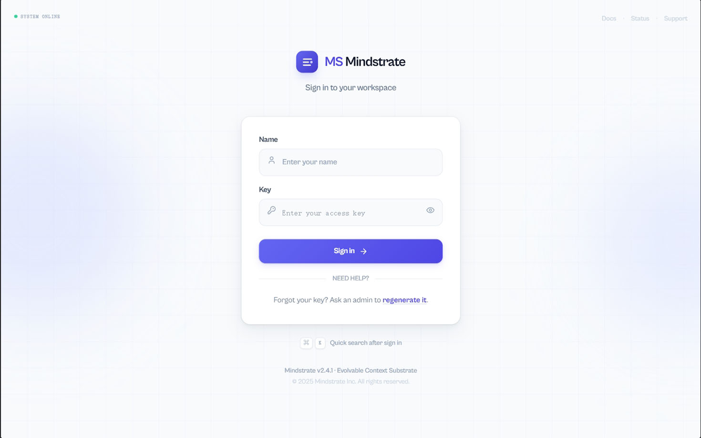
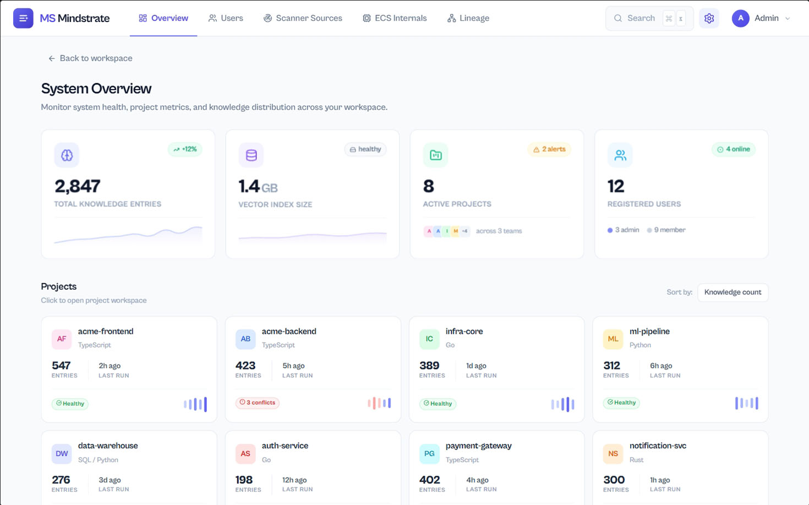
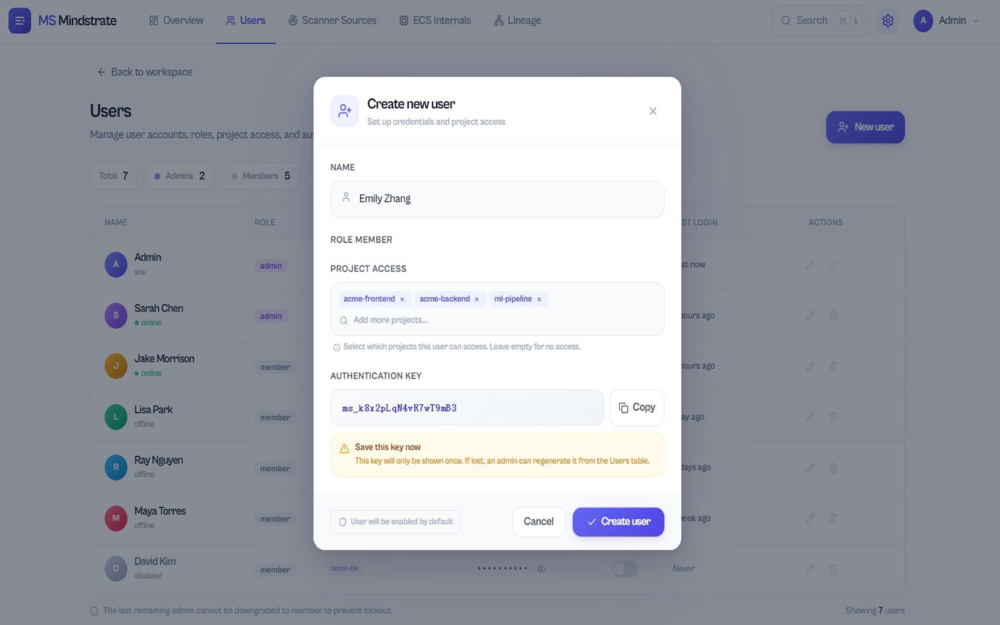
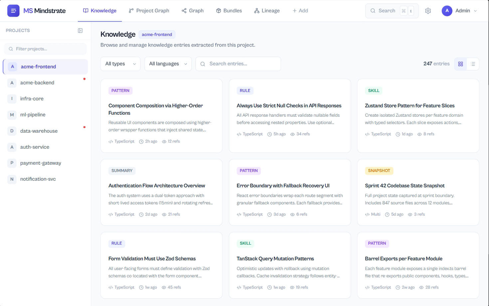
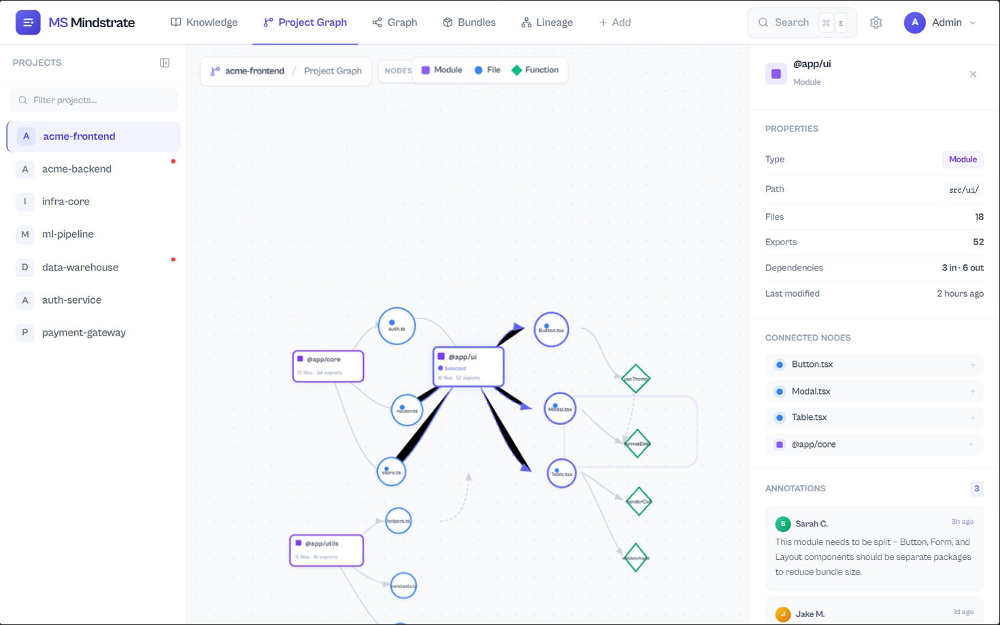
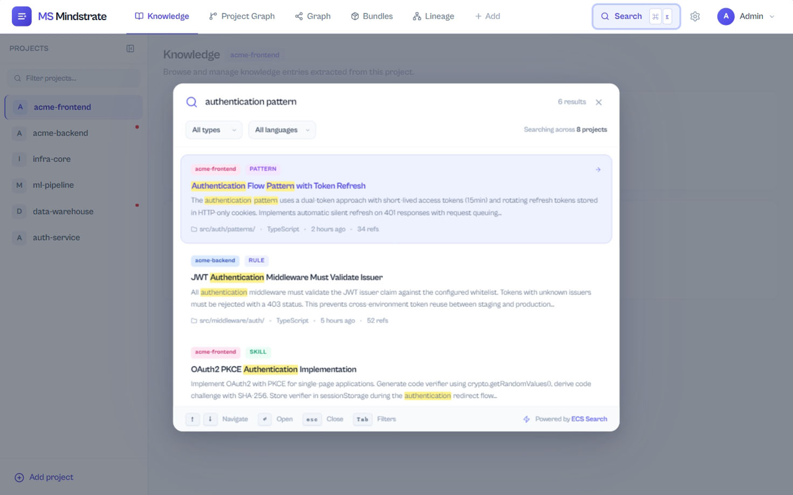

# Mindstrate

Language: [English](README.en.md) | [中文](README.zh-CN.md)

Mindstrate is an Evolvable Context Substrate (ECS) for AI coding agents. It treats memory as a metabolizing compression lineage: raw work episodes enter the system, then mature through usage, feedback, and pattern recognition into snapshots, summaries, patterns, skills, and rules, while stale or low-value context is archived, down-ranked, or forgotten.

Mindstrate is not only a vector retrieval backend and not only an endlessly growing file substrate. It turns project knowledge, session continuity, external engineering signals, and project graph facts into evidence-backed, governed, projectable working context for MCP, CLI, Team Server, Web UI, and Obsidian workflows.

Mindstrate supports two operating modes:

- **Local personal mode**: data lives under the current project `.mindstrate/`, with optional Obsidian output.
- **Team mode**: each member runs a local MCP server connected to one Team Server, sharing team knowledge and project graph context.

## Why Mindstrate

- **ECS memory lineage**: bug fixes, conventions, architecture decisions, gotchas, workflows, session summaries, skills, and rules are governed in one compression spectrum.
- **Memory metabolism engine**: Digest, Assimilate, Compress, Prune, and Reflect let memory absorb, merge, upgrade, down-rank, forget, and resolve conflicts.
- **Project graph context**: parser-first graph facts for files, dependencies, components, cross-system flows, risk hints, safety checks, evidence paths, and editable overlays.
- **External data collection**: Git, Perforce, hooks, daemon polling, and custom collectors live in `repo-scanner`; the framework receives standard `event`, `ChangeSet`, and `bundle` inputs.
- **Agent-friendly MCP tools**: search, write knowledge, assemble context, restore sessions, query the project graph, and record feedback.
- **Human-editable projections**: local mode can write project graph output to Obsidian; team mode can publish it to Team Server.

## Architecture Overview

```text
Local mode
AI tool -> MCP Server -> Mindstrate server runtime -> .mindstrate SQLite
                                      |
                                      +-> Obsidian projection

Team mode
AI tool -> local MCP Server -> Team Server HTTP API -> shared Mindstrate runtime
                                      |
                                      +-> Web UI
```

Main packages:

- `packages/protocol`: shared types and protocol contracts.
- `packages/client`: Team Server HTTP client.
- `packages/server`: core runtime and domain APIs.
- `packages/mcp-server`: MCP tools and resources.
- `packages/cli`: `mindstrate` / `ms` command line.
- `packages/repo-scanner`: external data collection tool.
- `packages/obsidian-sync`: Obsidian projection and sync.
- `packages/team-server`, `packages/web-ui`: team deployment surface.

See [Architecture](docs/architecture.en.md) for package boundaries.

## Web Console

Once Team Server is deployed, the Web UI is the single entry point for both admin configuration and member browsing. **LLM providers, scanner sources, and member API keys** are all governed per-project through the Web UI — no env vars required.

| | |
| --- | --- |
|  |  |
|  |  |
|  |  |

The admin signs in with the `TEAM_API_KEY` chosen at deployment time, then uses Settings to configure per-project LLM/embedding providers, Git/P4 scanner sources, and to mint API keys for team members scoped by project and role. See the [Installation Guide](docs/installation.en.md#web-console) for the full flow.

## Quick Start

### 1. Build From Source

```bash
git clone https://github.com/redasm/Mindstrate.git
cd Mindstrate
npm install
npx turbo build
npm link
```

### 2. Set Up Your Project

```bash
cd /path/to/your/project
mindstrate setup
```

The wizard lets you choose:

- local personal mode,
- team member client,
- or Team Server deployment config.

Non-interactive local mode:

```bash
mindstrate setup --mode local --tool opencode --yes
```

Team member setup:

```bash
mindstrate setup \
  --mode team \
  --tool cursor \
  --team-server-url http://team-server:3388 \
  --team-api-key <key>
```

See the [Installation Guide](docs/installation.en.md) for the full flow.

## Common Commands

```bash
mindstrate setup                     # local/team/server setup wizard
mindstrate init                      # idempotent project snapshot and graph init
mindstrate mcp setup --tool cursor   # write MCP config
mindstrate graph status              # show project graph projection status
mindstrate graph query "auth flow"   # search project graph nodes
mindstrate graph task before-edit "Source/Client" --project Client
mindstrate graph changes --source git # map changes to graph risks and safety issues
mindstrate graph ingest --changes changeset.json
mindstrate graph eval-dataset --out ./out/project-graph-eval
mindstrate vault export ~/Vault      # export knowledge to Obsidian
mindstrate eval                      # run retrieval quality evaluation
```

External collection:

```bash
mindstrate-scan ingest git --last-commit --project my-project
mindstrate-scan ingest p4 --recent 10 --project my-project
mindstrate-scan source add-git --name repo --project my-project --repo-path .
mindstrate-scan daemon
```

## Project Graph And Edit Safety

Mindstrate's project graph is more than a file index. Extracted facts are turned into agent-actionable before-edit reports and impact analysis:

- `before-edit` / `impact` reports include classification, known constraints, affected chains, source of truth, do-not-edit targets, required searches, recommended verification, and relevant overlays.
- CLI commands such as `mindstrate graph changes` and `mindstrate graph ingest` show safety issues, including direct generated-file edits, missing `.uplugin` plugin dependencies, and Runtime modules depending on Editor-only modules.
- MCP project graph tools expose safety issues in `before-edit` / `impact` reports so agents can identify global risks before editing.
- Obsidian projections generate system architecture pages, summary pages, and generated detail pages while preserving user notes and structured overlays for human confirmations.
- High-impact graph nodes carry `impactTags`, such as `build-critical`, `project-manifest`, `plugin-manifest`, `config-sensitive`, `asset-reference-sensitive`, `generated`, `do-not-edit`, `runtime-module`, and `editor-only`.

Unreal project graph extraction includes:

- `.uproject` enabled plugins, `.uplugin` modules / dependency plugins, and `*.Build.cs` public/private module dependencies.
- `UCLASS`, `USTRUCT`, `UENUM`, `UFUNCTION`, and `UPROPERTY` extraction with native-to-TypeScript usage surfaces.
- `Config/*.ini` references such as `/Script/Module.Class` and plugin config entries.
- Unreal Asset Registry soft/hard asset references.
- Generated/source-of-truth, generated roots, Config, Content asset, and Runtime/Editor module boundary risk metadata.

## Documentation

- [Installation Guide](docs/installation.en.md): local setup, Team Server deployment, team member setup, MCP config, LLM providers.
- [Data Collection Guide](docs/data-collection.en.md): `repo-scanner`, Git/P4, hooks, daemon, custom collectors, standard `ChangeSet`.
- [Project Configuration](docs/project-configuration.en.md): `.mindstrate/project.json`, `.mindstrate/config.json`, built-in rules, custom `.mindstrate/rules/*.json`.
- [Project Detection Rules](docs/project-detection-rules.en.md): rule schema, match conditions, security boundary.
- [Deployment Guide](docs/deployment-guide.en.md): deployment modes and operations guide.
- [Repo Scanner](docs/repo-scanner.en.md): external repository collection boundary and workflows.
- [Project Graph](docs/project-graph.en.md): parser-first project graph pipeline and query surface.
- [ECS Memory Architecture](docs/ecs-memory.en.md): evolvable context substrate, experience compression lineage, and memory metabolism model.
- [Context Engineering](docs/context-engineering.en.md): working-context assembly policy.

## Runtime API Shape

`Mindstrate` is a lifecycle facade. Business capabilities live under explicit subdomain APIs:

```ts
import { Mindstrate } from '@mindstrate/server';

const memory = new Mindstrate();
await memory.init();

await memory.knowledge.add(input);
await memory.snapshots.upsertProjectSnapshot(project);
const nodes = memory.context.queryContextGraph({ query: 'auth flow', project: 'web' });
const context = await memory.assembly.assembleContext('fix flaky test', { project: 'server' });
await memory.events.ingestEvent(event);
await memory.metabolism.runMetabolism({ project: 'server', trigger: 'manual' });

memory.close();
```

Subdomains include `knowledge`, `snapshots`, `context`, `assembly`, `events`, `sessions`, `metabolism`, `evaluation`, `projections`, `bundles`, and `maintenance`.

## Repository Layout

```text
Mindstrate/
├── docs/                 # user and architecture docs
├── deploy/               # Team Server + Web UI Docker compose
├── install/              # team member MCP installer scripts
├── packages/
│   ├── protocol/
│   ├── client/
│   ├── server/
│   ├── mcp-server/
│   ├── cli/
│   ├── repo-scanner/
│   ├── obsidian-sync/
│   ├── team-server/
│   └── web-ui/
└── AGENTS.md             # implementation rules for AI agents in this repo
```

## License

Apache-2.0
